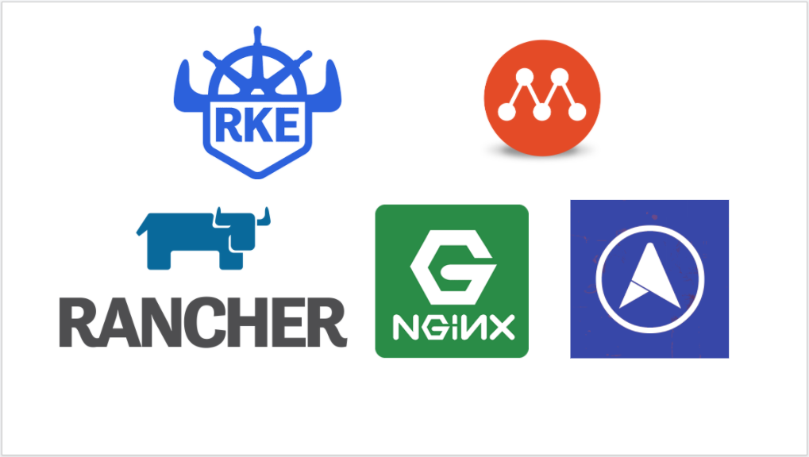

# Rancher Kubernetes Engine and Rancher Server on Multipass VMs on your local machine



## Who should use this?

Those Ops or sometimes Devs who'd like to get familiar with a full-fledged Rancher Kubernetes Engine and Rancher Server on their local machine using Multipass VMs to reduce their cloud costs. This implementation is not an alternative to k3d, k3s, k3sup, etc..

## Prerequisites

You need Multipass running on your local machine with mkcert installed, to learn more about Multipass, please visit:

https://github.com/CanonicalLtd/multipass

https://multipass.run/

[mkcert](https://github.com/FiloSottile/mkcert)

This setup was tested on MacOS, but should work on Linux or Windows too.

You need to have about 6GB RAM and 24GB storage on your local machine.

You need kubectl in your path, if not, you can download the v1.15.0 version and put it in your path:

MacOS users:

```bash
curl -LO https://storage.googleapis.com/kubernetes-release/release/v1.17.5/bin/darwin/amd64/kubectl
```

Linux users:

```bash
curl -LO https://storage.googleapis.com/kubernetes-release/release/v1.17.5/bin/linux/amd64/kubectl
```

```bash
chmod +x ./kubectl
mv kubectl /usr/local/bin/
```

## Installation

### Important hint for linux users

Linux users should adapt the `create-hosts.sh` and adapt the network interface name. You can find the nic name with:

```bash
multipass launch --name test
multipass exec test -- bash -c 'echo `ls /sys/class/net | grep en`'
```

Delete and purge the test VM:

```bash
multipass delete test
multipass purge
```

If the above doesn't work somehow, shell into the node and get the nic name:

```bash
multipass shell test
ifconfig
```

Clone this repo and run the scripts as follow:

```bash
git clone https://github.com/arashkaffamanesh/multipass-rke-rancher.git
cd multipass-rke-rancher
./1-deploy-multipass-vms.sh
./2-deploy-rke.sh
./3-deploy-rancher-on-rke.sh
# or with mkcert to get a vaild certificate (on macos), you need to install mkcert, pls. have a look in the script
./ 3-deploy-rancher-on-rke-mkcert-macos.sh
```

or with a single command:

```bash
./deploy.sh
```

## What you get

You should get a running RKE Cluster on 3 Multipass VMs with Rancher Server on top in about 12 minutes (depends on your CPU / internet speed and docker hub performance).

You should get something like this at the End:

```bash
############################################################################
This should take about 4 minutes, wait for the browser to pop up and enjoy :-)
############################################################################
Waiting for deployment "rancher" rollout to finish: 0 of 3 updated replicas are available...
Waiting for deployment "rancher" rollout to finish: 1 of 3 updated replicas are available...
Waiting for deployment "rancher" rollout to finish: 2 of 3 updated replicas are available...
deployment "rancher" successfully rolled out
Total runtime in minutes: 11:58
############################################################################
```

## Access the Rancher Server on RKE

A tab will open in your browser and point to:

https://gui.rancher.svc/

## Install Metal-LB

Install Metal-LB to have support for service type LoadBalancer:

```bash
./install-metal-lb.sh
# Test the metal lb install with the custom built nginx server with self signed certificate and port 443 enabled:
k create -f nginx-local-ssl/nginx-local-ssl.yaml
```

## Clean Up

```bash
./cleanup-rkes.sh
```

## Blog post

Blog post will be published on medium:

https://blog.kubernauts.io/
